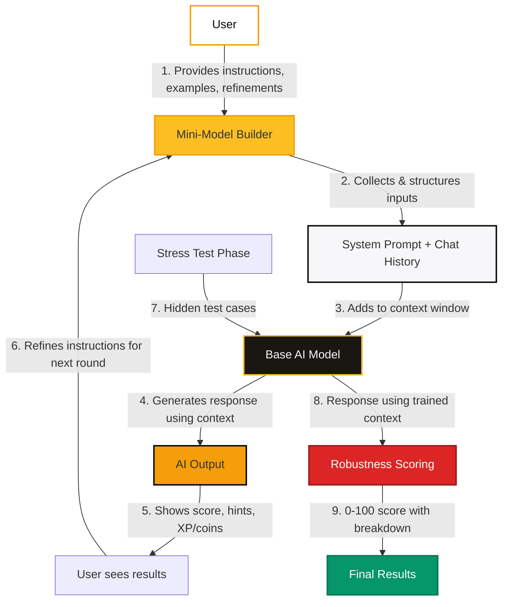

# How PoshPrompt Mini-Models Work

## The "Mini-Model" Concept

The "mini-model" is essentially clever prompt engineering combined with context management. Here's what's really happening:

1. **User Training**: You provide instructions, examples, and refinements for a specific AI persona or task
2. **Context Collection**: The system accumulates everything you write into a structured system prompt + chat history
3. **Single Model Inference**: All requests go to the same base AI model (e.g., Qwen2.5-32B-Instruct)
4. **Context Injection**: Your accumulated prompt context is injected into each API call
5. **Consistent Persona**: The model responds using your trained context, creating the illusion of a "custom model"

This is exactly how custom GPTs, AI agents, and prompt-based systems work in production. The magic is in the prompt engineering, not in creating separate AI models.

## Your Role as AI Trainer

"Your Mini-Model" is really your AI trainee. You're the teacher, and the AI is your student. Here's the training process:

### Training Phase (4-5 rounds)
- **Round 1**: You establish the basic persona and rules
- **Round 2-4**: You refine and improve based on AI responses
- **Round 5**: Final polish and preparation for stress testing

Each round builds on the previous ones, creating a rich context that guides the AI's behavior.

### Stress Test Phase
After training, the system tests your mini-model with hidden adversarial cases:
- **Adversarial inputs**: Attempts to break or confuse your AI
- **Edge cases**: Unusual but valid scenarios
- **Consistency checks**: Similar inputs should get similar outputs
- **Constraint testing**: Extreme limits on format or length

The AI receives the same accumulated context plus the new test case, and we score how well it maintains your training.

## Technical Architecture

## Why This Approach Works

### 1. **Cost Effective**
- One AI model serves all users
- No per-user model training costs
- Scales horizontally with user base

### 2. **Consistent Quality**
- Same base model ensures predictable performance
- Context limits prevent degradation
- Standardized testing across all mini-models

### 3. **Rapid Iteration**
- Users can train multiple mini-models quickly
- No waiting for model fine-tuning
- Instant feedback and improvement

### 4. **Safe and Contained**
- No risk of users creating harmful models
- All outputs go through safety filters
- Context limits prevent prompt injection attacks

## What Makes a Good Mini-Model

### Clear Constraints
- Specific rules about what to do and not do
- Examples of good and bad responses
- Clear persona definition

### Consistent Context
- All training rounds build on each other
- No contradictory instructions
- Stable persona throughout training

### Robust Design
- Anticipates edge cases and adversarial inputs
- Handles constraints gracefully
- Maintains persona under pressure

## Privacy and Data

- Your training context is used only for your mini-model
- Chat history is stored securely in our database
- Stress test cases are predefined and not shared with users
- No user data is used to train the base AI model

## The "Illusion" Explained

When you interact with your trained mini-model, it feels like you're talking to a custom AI. In reality:

1. **Same Model**: Every request goes to the identical base AI model
2. **Different Context**: Each request includes your unique training context
3. **Guided Response**: The model uses your context to shape its response
4. **Consistent Behavior**: Repeated similar contexts create consistent behavior

This is the same principle behind:
- Custom GPTs in ChatGPT
- AI agents in enterprise systems
- Prompt-based applications
- Few-shot learning demonstrations

## Future Possibilities

While our current approach uses prompt engineering, future enhancements could include:

- **Fine-tuning**: Create actual custom models for top performers
- **Model Merging**: Combine successful mini-models
- **Specialized Models**: Domain-specific base models
- **Multi-modal**: Add image, audio, and video capabilities

The core principle remains the same: **You teach the AI, and it learns from your guidance.**
